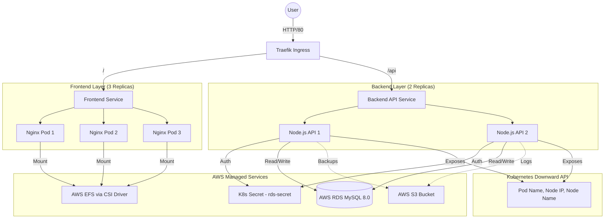

# 🚀 K8s High Availability Website Project - Technical Report

## 1. Architecture Overview

This project is a **Highly Available (HA) Full-Stack Web Application** deployed on a Kubernetes cluster, powered by **AWS managed services**. It demonstrates modern DevOps practices including Containerization, Orchestration, CI/CD, Cloud-Native Storage, and a live HA dashboard for real-time pod/node visualization.

### System Diagram


---

## 2. Infrastructure Layer

### Kubernetes Cluster (K3s)
- **Master Node**: Control plane
- **Worker 1 & 2**: Application nodes
- **Strategy**: Pods are distributed across all 3 nodes via anti-affinity rules for High Availability.

### Storage — AWS EFS (replaces NFS)
- **Why EFS?** Provides a fully managed, elastic, cloud-native shared file system.
- **How it works**:
  - **EFS CSI Driver**: Installed in the cluster to provision EFS volumes dynamically.
  - **StorageClass (`efs-storageclass.yaml`)**: Defines the EFS provisioner with dynamic access point creation.
  - **PVC (`efs-pvc.yaml`)**: Requests `ReadWriteMany` storage — all pods across all nodes can mount the same volume simultaneously.
  - **Result**: No more managing an NFS server on the master node. AWS handles durability, replication, and scaling automatically.

### Asset Storage — AWS S3
- **Purpose**: Stores static assets, database backups, and application logs.
- **Features**: Versioning enabled, AES-256 encryption, lifecycle policies for log rotation (30 days → Glacier, 90 days → delete).
- **ConfigMap (`s3-configmap.yaml`)**: Injects S3 bucket name and region into backend pods.

---

## 3. Database Layer — AWS RDS MySQL

### Why RDS? (replaces in-cluster MySQL)
| Aspect | Before (In-Cluster MySQL) | After (AWS RDS) |
|--------|---------------------------|-----------------|
| **Management** | Manual pod management | Fully managed by AWS |
| **High Availability** | Single pod, single point of failure | Multi-AZ deployment |
| **Backups** | Manual / none | Automated daily backups (7-day retention) |
| **Encryption** | None | At-rest + in-transit encryption |
| **Scaling** | Recreate deployment | One-click vertical scaling |
| **Updates** | Manual image updates | Automated minor version upgrades |

### Configuration
- **Secret (`rds-secret.yaml`)**: Stores RDS endpoint, database name, user, password, and port as base64-encoded K8s Secret.
- **Connection**: Backend pods connect to the RDS endpoint directly (no in-cluster MySQL needed).
- **Security**: RDS Security Group allows inbound TCP 3306 only from K8s node Security Group.

---

## 4. Backend Layer (Node.js API)

### Code (`backend/server.js`)
- **Technology**: Express.js + MySQL2 client.
- **Key Endpoints**:
  - `GET /api/pod-info` — Returns Kubernetes pod & node metadata for HA visualization.
  - `GET /api/guestbook` — Fetch guestbook entries with pod/node attribution.
  - `POST /api/guestbook` — Add entry with automatic pod/node tagging.
  - `GET /api/health` — Health check with pod/node info.
  - `DELETE /api/guestbook/:id` — Remove a guestbook entry.

### Pod Info Endpoint (`/api/pod-info`)
This is the core of the HA dashboard. It returns:
```json
{
  "podName": "guestbook-api-6b8f9c7d5-x4k2m",
  "podIP": "10.42.1.15",
  "podNamespace": "default",
  "nodeName": "worker-1",
  "nodeIP": "172.31.20.45",
  "requestCount": 42,
  "uptime": "2h 15m 30s",
  "memoryUsage": "45.2 MB",
  "dbType": "AWS RDS MySQL",
  "storageType": "AWS EFS",
  "assetStorage": "AWS S3"
}
```

### How Pod Metadata Works (Kubernetes Downward API)
The deployment injects environment variables using `fieldRef`:
- `POD_NAME` ← `metadata.name`
- `POD_IP` ← `status.podIP`
- `NODE_NAME` ← `spec.nodeName`
- `NODE_IP` ← `status.hostIP`
- `POD_NAMESPACE` ← `metadata.namespace`
- Resource limits via `resourceFieldRef`

### Deployment (`backend/backend-deployment.yaml`)
- **Replicas**: 2 (For HA).
- **Env Vars**: RDS credentials from `rds-secret`, S3 config from `s3-configmap`, Downward API for pod/node metadata.
- **Probes**: Liveness and readiness checks on `/api/health`.

---

## 5. Frontend Layer (HA Dashboard)

### Website (`index.html`)
- **Technology**: Plain HTML/CSS/JS (no framework needed).
- **Key Features**:
  - **Live Stats Bar**: Shows current pod name, node name, node IP, request count, uptime, memory.
  - **Request Flow Visualization**: Animated path: Browser → Ingress → Pod → Node → RDS.
  - **Pod History Tracking**: Remembers which pods served previous requests (demonstrates load balancing).
  - **Auto-Refresh**: Fetches `/api/pod-info` every 5 seconds with progress bar.
  - **Guestbook**: Entries tagged with the pod/node that processed them.
  - **Architecture Grid**: Visual cards for all components including AWS services.

### How it Demonstrates HA
1. **Auto-refresh** calls `/api/pod-info` every 5 seconds.
2. Kubernetes load balances across backend pods on different nodes.
3. The dashboard shows **different pod names and node IPs** on successive requests.
4. Pod history accumulates, showing all the pods that have served you.
5. Even if you delete a pod, the dashboard continues working (new pod takes over).

---

## 6. Networking Layer

### Services (`service.yaml`, `backend-service.yaml`)
- **Frontend**: `NodePort` type (accessible from outside the cluster).
- **Backend**: `ClusterIP` type (internal only, accessed via Ingress).
- **Session Affinity**: Removed to demonstrate load balancing across pods.

### Ingress (`ingress.yaml`)
- **Controller**: Traefik (built-in to K3s).
- **Routing Rules**:
  - `path: /api` → Routes to **Backend Service** (Node.js)
  - `path: /` → Routes to **Frontend Service** (Nginx)

---

## 7. CI/CD Pipeline (GitHub Actions)

### Workflow (`.github/workflows/deploy.yml`)
**Trigger**: Push to `main` branch.

**Job 1 & 2: Build (Parallel)**
1. Checks out code.
2. Logs in to **GitHub Container Registry (GHCR)**.
3. Builds Docker images for Frontend and Backend.
4. Pushes images to GHCR with `latest` and `commit-sha` tags.

**Job 3: Deploy**
1. **SCP (Copy)**: Copies the latest YAML manifests to the K8s Master node.
2. **SSH (Execute)**: Runs `kubectl apply` and `kubectl rollout restart` for zero-downtime updates.

---

## 8. AWS Services Summary

| AWS Service | Purpose | K8s Integration | Key Benefits |
|-------------|---------|-----------------|--------------|
| **EFS** | Shared file system for pods | EFS CSI Driver + StorageClass | ReadWriteMany, auto-scaling, no server to manage |
| **RDS MySQL** | Managed database | External endpoint via K8s Secret | Multi-AZ HA, automated backups, encryption |
| **S3** | Asset & backup storage | ConfigMap with bucket details | Versioning, encryption, lifecycle policies |

---

## Summary of "How it Works Together"

1. **Developer** pushes code change to GitHub.
2. **GitHub Actions** builds new Docker images and pushes to Registry.
3. **GitHub Actions** SSHs into Cluster and tells K8s to update.
4. **Kubernetes** starts new pods with new images.
5. **Traefik Ingress** routes user traffic to Frontend pods (served from Nginx).
6. **Frontend** dashboard auto-calls `/api/pod-info` every 5 seconds.
7. **Ingress** routes `/api` requests to one of the Backend pods.
8. **Backend** responds with pod name, node name, node IP (from Downward API).
9. **Dashboard** displays which pod/node served the request, demonstrating HA.
10. **Guestbook** entries are stored in **AWS RDS MySQL** (no in-cluster DB needed).
11. **All pods** share storage via **AWS EFS** (no NFS server to manage).
12. **Backups and assets** are stored in **AWS S3**.

**Result**: A fully automated, self-healing, highly available application powered by AWS managed services! 🚀
